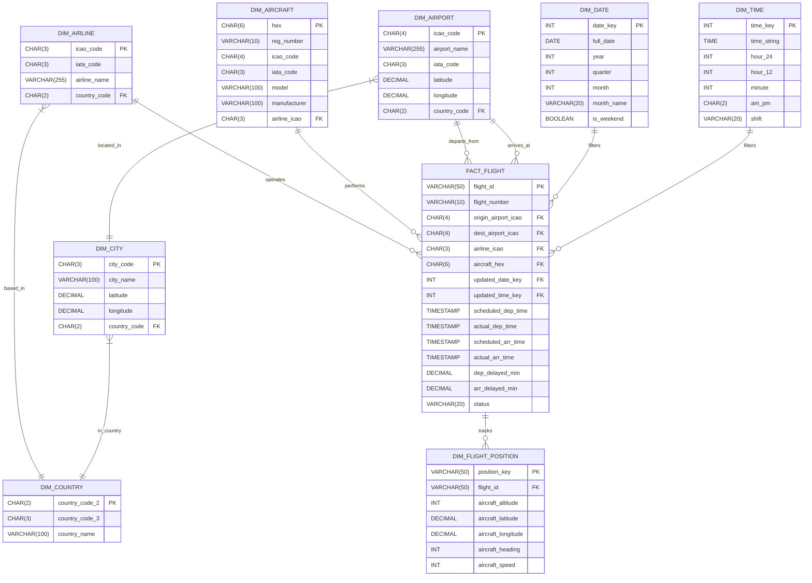

# Data Engineering Project: Airline Pipeline Analysis
## Step 2: Data Modeling & Architecture Report

- **Group Members:** Leoni GILKE, Rustam U.
- **Submission Date:** July 9, 2026  
- **Course:** ETL Intermediate (AE) Bootcamp — Jun26 (Mar26) English

---

## 1. Architectural Strategy: Star Schema
To ensure high-performance analytical queries for our Power BI dashboard, we have adopted a **Star Schema** architecture. While we acknowledge the theoretical benefits of 3NF (Snowflake) for data integrity, we have opted for a denormalized Star Schema to optimize for dashboard read-latency and simplified relationship mapping.

---

## 2. Database Schema (UML/Mermaid)

**Data Schema Granularity Definition**: 
The granularity of our database is defined at the atomic level: one row represents a single, unique flight movement. We utilize a surrogate `flight_id` as the primary key to ensure each event is distinct, while foreign keys provide the relational context required to link to `aircraft`, `airline`, and `airport` dimension tables. Additionally, high-frequency telemetry tracking is isolated in the child table `dim_flight_position` via a composite smart key (`position_key`), preventing unique constraint collisions during routine incremental loads.

### Data Validation & Schema Design
To ensure optimal database performance and data integrity, I conducted a Character Length Frequency Analysis (CLFA) on raw API responses from the `flights` and `schedules` API endpoints. This analysis identified the minimum and maximum character bounds for all fields, which served as the empirical basis for defining the schema, specifically in choosing appropriate VARCHAR lengths and DECIMAL precision.

---

## 3. Data Dictionary
Our architectural layout decouples transaction metrics from master entity registries by deploying a normalized relational structure. The core schema maps an immutable transaction ledger against independent operational dimension matrices:

- **Fact Table:** `fact_flight` (Central transaction log tracking real-time telemetry metrics, snapshots, and foreign key pathways passing through primary operational hubs)
- **Dimension Tables:**
    - `dim_country`: Base-level geographical tracking cataloging ISO alphanumeric codes.
    - `dim_city`: Intermediate lookup hierarchy binding urban operational zones to country roots.
    - `dim_airport`: Detailed terminal geographic data mapped precisely via latitude/longitude decimals.
    - `dim_aircraft`: Aircraft physical tracking metadata mapping specific vehicle transponders, incorporating automatic recovery backfills for unassigned registrations (`UNKNOWN_REG`).
    - `dim_airline`: Commercial operating carrier branding, descriptive business name maps, and foreign key relationships bound to `dim_country`.
    - `dim_time` & `dim_date`: Granular deterministic temporal and calendar dimensions designed for timeline analysis.
    - `dim_flight_position`: Minute-grain spatial telemetry positioning records mapped cleanly via smart primary keys (`position_key`).

---

## 4. Implementation
- **SQL Structure:** Initialized via `database_schema/schema.sql` and populated through our automated 3-script execution framework (`pipeline_init.py`, `pipeline_monthly.py`, `pipeline_daily.py`).
- **Design Rationale:** By centralizing flight events in the `fact_flight` table and referencing immutable metadata in `dim_` tables, we maintain a "Single Source of Truth" while enabling rapid, multi-dimensional filtering. The architecture employs rigorous foreign key constraints (such as `dim_airline.country_code` referencing `dim_country.country_code_2`) alongside automated ingestion deduplication safeguards to prevent runtime `IntegrityError` exceptions.